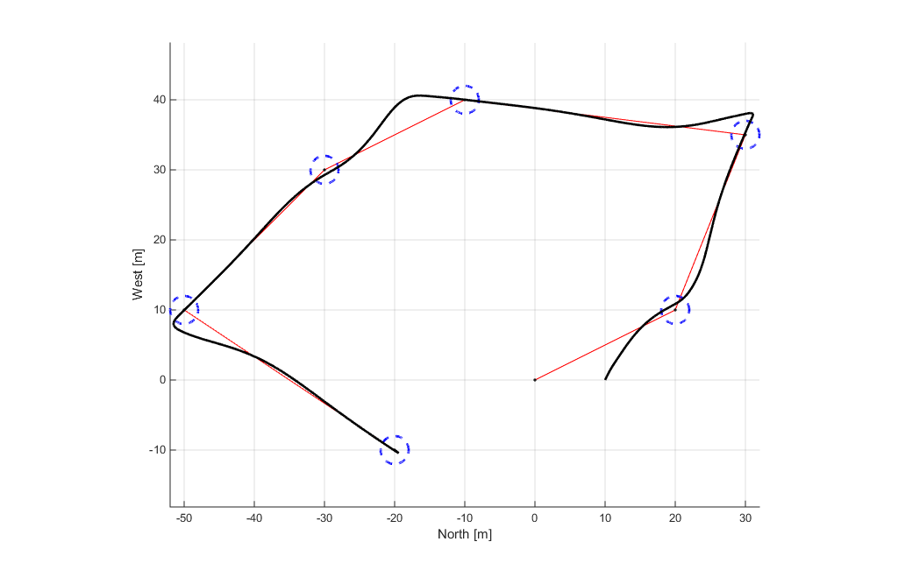

# Quadrotor

This project is developed for testing how different altitude and attitude controllers work on a quadrotor in X-configuration.

The quadrotor will navigate throug a series of predefined waypoints in the North-West plane while maintaining a fixed altitude. The waypoints are defined in the 'update_waypoints.m' file.

